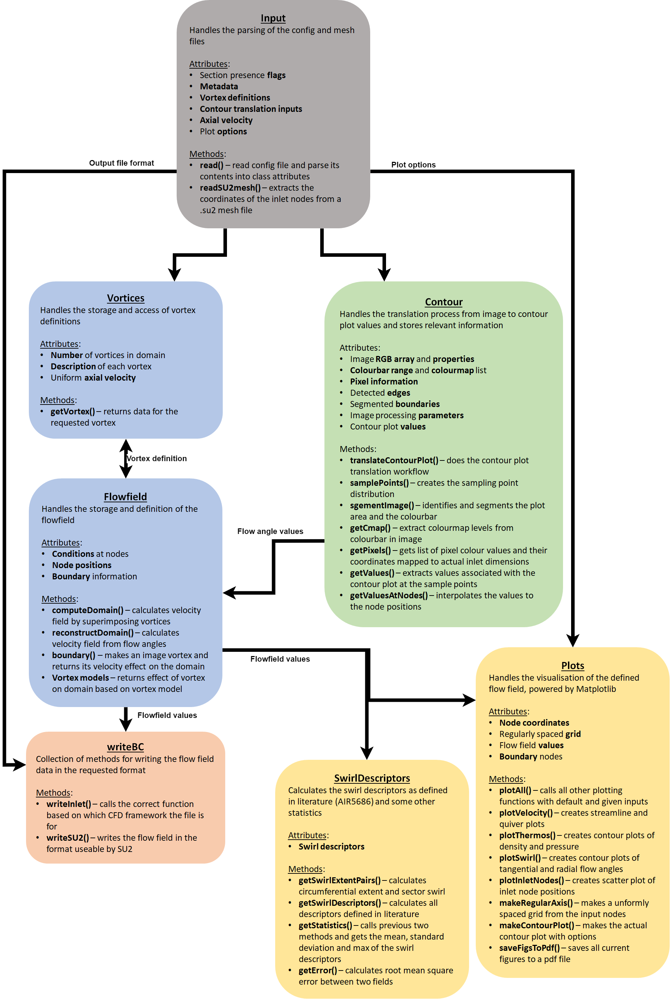

# Virtual SwirlGenerator
 Python tool for creating arbitrary swirling inflow boundary conditions for use with a CFD framework. Created as part of a Master's dissertation for MEng Aerospace Engineering.
 
 Toolkit containing methods for generating inlet conditions for CFD including parameterised creation of continuous vortical distributions and extraction of numerical data from images of contour plots.

## Dependencies
- numpy (1.19.3)
- matplotlib
- scipy
- alphashape
- opencv-python


## Basic Usage
### Command Line Control
`python swirlgenerator <config file>` performs the basic functionality of the tool. Generates a boundary condition according to the options specified in the config file. A template config file has been included in the repository which shows all available functionality/configurations.
 
`python /swirlgenerator -help` shows the command line options available for performing extra functionality. 


### Calling from user scripts
The generic workflow and method for generating boundary conditions using swirlgenerator functions is illustrated within **Main.py**. This serves as a showcase for the capabilities of the tool.

**An example workflow is shown here:**
The toolkit can be called similar to a library to give users more control. Allows for easier integration within existing Python workflows or for parametric control (especially relevant for the contour translation method). The Testing folder contains examples of the swirlgenerator methods integrated into parametric studies.

A list of node coordinates needs to be provided. Swirlgenerator provides capability for extracting the nodes making up the inlet plane of a mesh from the **pre.py** module.
```
nodes = pre.Input.extractMesh(meshfilename)
```
This can be bypassed if the user already has the node coordinates - in the form of a list of 3D vectors, shape (n,3).

These node coordinates are used to initialise a *FlowField* class instance.
```
flowfield = core.FlowField(nodes)
```

From here, there are two methods which can be used to generate a swirling inlet velocity field:

- **[Vortex Method]**, creating a velocity profile by combining the effect of multiple discrete vortices (from core.py module).
```
# Initialise the domain configuration with information about each vortex to be defined within the domain.
vortexDefs = core.Vortices(model, centres, strengths, core_radii)

# Calculate the velocity field with
flowfield.computeDomain(vortexDefs, axialVel)
```

- **[Contour Translation Method]**, reconstructing a velocity profile by translating contour plot images of tangenetial and radial flow angles (from contour_translation.py module). Swirlgenerator also has the capability of extracting the colour map from a colour bar within the image, this can be useful for correcting for systematic errors within the image.
```
import contour_translation as ct

# Estimate the values used to create the plots within the images using inverse colour mapping
tangential = ct.Contour(image_of_tangential_flow_angle_plot, colourbar_range, doTranslation=True, cmap=)
radial     = ct.Contour(image_of_radial_flow_angle_plot,     colourbar_range, doTranslation=True, cmap=)

# Reconstruct the velocity field with [the (uniform) axial velocity of the bulk flow needs to be provided also]
flowfield.reconstructDomain(tangential.getValuesAtNodes(flowfield.coords), radial.getValuesAtNodes(flowfield.coords), inputData.axialVel)
```

The actual boundary condition data file can then be created, in this case for an SU2 simulation.
```
writeBC.writeSU2(flowfield, filename)
```


## Method of generation
1. Calculated by placing multiple discrete vortices into the domain and modelling how they would interact with simple velocity vector summations.

2. Image recognition capability for receiving contour plots of tangential and radial flow angles and generating an approximation of the underlying velocity field.

## Code architecture
The code base follows an object oriented approach to facilitate expansion and integration into workflows.

The main classes and their interfaces:


## Theory
Details of the implemented methods and their performance are reported within [**Computational methods for generating swirling inlet boundary conditions for CFD** - G. Vidanes](Vidanes_G_Computational_methods_for_generating_swirling_inlet_boundary_conditions_for_CFD.pdf)

## Limitations
- Only su2 format for the boundary condition is currently supported by the *writeBC* modules
- Only su2 mesh format can be read directly by the *pre* module
- Vortex method only supports incompressible boundary conditions
